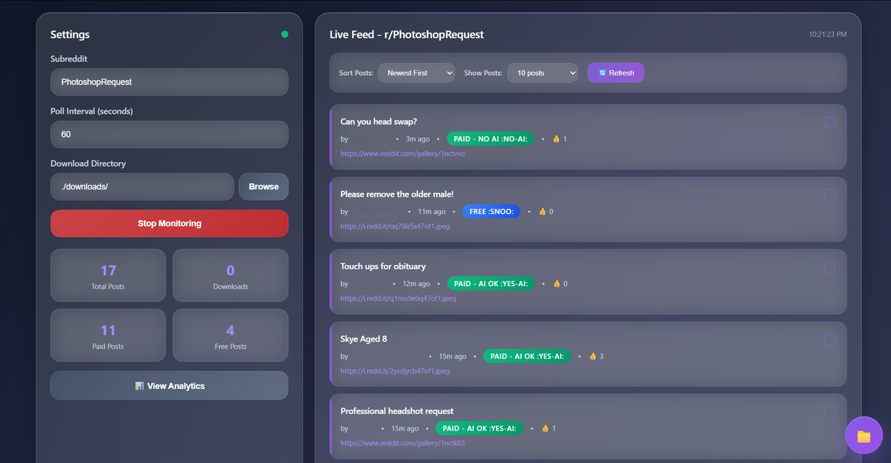

# Reddit PhotoshopRequest Monitor

Real-time monitor for new posts in `r/PhotoshopRequest`, with local persistence, filtering, workflow tracking, analytics, and bulk image downloads.



## What it does

- Watches `r/PhotoshopRequest` for new posts on a polling interval
- Shows a live feed with sorting and filters (newest, upvoted, paid/free)
- Tracks completion state per post (local)
- Downloads images from posts (single images and Reddit galleries)
- Builds local analytics from observed posts (hour/day/week patterns, paid vs free)

## How it works

- Backend: Python + PRAW polls Reddit and exposes data to the UI via Eel
- Frontend: HTML/CSS/JS renders the feed, filters, and analytics; charts via ApexCharts

## Requirements

- Python 3.7+
- Reddit API credentials
- Network access to Reddit

## Quickstart

### 1) Install

```bash
git clone https://github.com/yourusername/reddit-photoshop-monitor.git
cd reddit-photoshop-monitor
pip install -r requirements.txt
```

### 2) Create Reddit API credentials

1. Visit [Reddit Apps](https://www.reddit.com/prefs/apps)
2. Click "Create App" or "Create Another App"
3. Choose "script" as the app type
4. Fill in the form.

### 3) Configure environment

Create `.env` in the project root:

```env
CLIENT_ID=your_client_id_here
CLIENT_SECRET=your_client_secret_here
USER_AGENT=script:photoshop_monitor:v1.0 (by /u/yourusername)
```

Credential locations in the Reddit app page:

- `CLIENT_ID`: the short ID under the app name
- `CLIENT_SECRET`: the “secret” field
- `USER_AGENT`: identify the script and account

### 4) Run

```bash
python main.py
```

UI opens at `http://localhost:8080`.

## Usage

### Feed

- Live updates based on polling interval
- Filters: paid/free, sort options
- Per-post completion toggle stored locally

### Post details

- Click a post to open a detail view (metadata + download actions)

### Downloads

- Supports direct images and Reddit galleries
- Tracks progress and status
- Saves to a configurable directory

### Analytics

- Hourly/daily/weekly activity breakdown based on observed posts
- Paid vs free distribution
- Basic engagement signals (upvotes/author counts as collected)

## Configuration

Controlled from the UI:

- Polling interval (10–3600 seconds)
- Download directory
- Post display limit (5–100 or all)
- Feed sorting and filters

## Local data files

Generated in the project directory:

| File | Purpose |
| --- | --- |
| `activity_logs.log` | runtime activity log |
| `posts_analytics.log` | aggregated analytics input data |
| `completed_posts.json` | completion state per post |
| `last_post.json` | last-seen post/session state |

## Project layout

```
reddit-photoshop-monitor/
├── main.py                  # App entry point
├── downloader.py            # Download logic / helper module
├── requirements.txt
├── .env                     # Local
├── web/
│   ├── index.html
│   ├── styles.css
│   ├── main.js
│   ├── post-management.js
│   ├── monitoring.js
│   ├── analytics.js
│   ├── ui-utils.js
│   ├── persistence.js
│   └── demo.js
└── README.md
```

## Troubleshooting

- Reddit API connection failed: incorrect `.env` values, app not set to `script`, missing/invalid user agent
- No posts loading: network failure, Reddit downtime, rate limiting, invalid subreddit scope
- Download failed: unwritable download directory, post has no downloadable image media, gallery resolution issues
- Charts missing: ApexCharts CDN blocked/unreachable, browser console shows script load errors

## Notes and limitations

- Polling frequency and API rate limits constrain “real-time” behavior
- Completion state and analytics are local to the machine running the app
- `.env` contains secrets; keep it out of version control

## License

MIT. See `LICENSE`.
